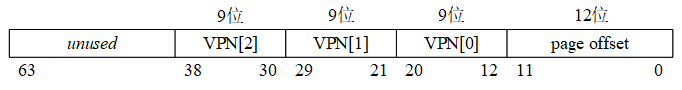
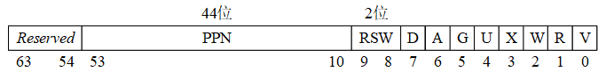
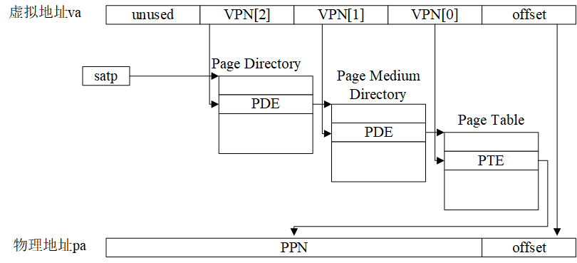
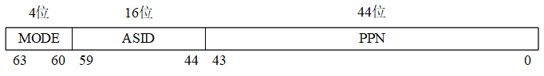
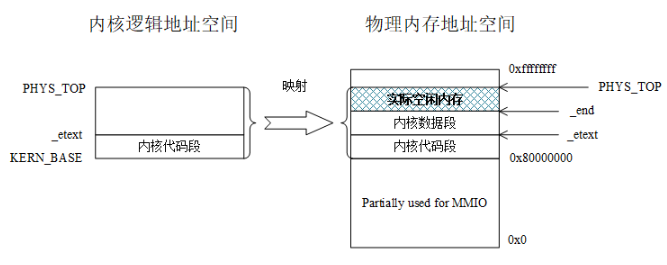

+++
title = 'ProxyKernel'
date = 2024-03-27T18:52:42+08:00
draft = false
+++

## 1 系统启动

### 1.1 内核的载入
由于是“代理内核”，PK 并不运行在真正的机器上，Spike 模拟器将其当作一个 ELF 文件载入，所以可以通过 readelf 来看内核的可执行程序。
```shell
$ riscv64-unknown-elf-readelf -h ./obj/riscv-pke
ELF Header:
  Magic:   7f 45 4c 46 02 01 01 00 00 00 00 00 00 00 00 00
  Class:                             ELF64
  Data:                              2's complement, little endian
  Version:                           1 (current)
  OS/ABI:                            UNIX - System V
  ABI Version:                       0
  Type:                              EXEC (Executable file)
  Machine:                           RISC-V
  Version:                           0x1
  Entry point address:               0x80000548
  Start of program headers:          64 (bytes into file)
  Start of section headers:          130760 (bytes into file)
  Flags:                             0x5, RVC, double-float ABI
  Size of this header:               64 (bytes)
  Size of program headers:           56 (bytes)
  Number of program headers:         2
  Size of section headers:           64 (bytes)
  Number of section headers:         18
  Section header string table index: 17

$ riscv64-unknown-elf-readelf -l ./obj/riscv-pke

Elf file type is EXEC (Executable file)
Entry point 0x80000548
There are 2 program headers, starting at offset 64

Program Headers:
  Type           Offset             VirtAddr           PhysAddr
                 FileSiz            MemSiz              Flags  Align
  LOAD           0x0000000000001000 0x0000000080000000 0x0000000080000000
                 0x0000000000003564 0x0000000000003564  R E    0x1000
  LOAD           0x0000000000005000 0x0000000080004000 0x0000000080004000
                 0x0000000000001411 0x00000000000098b8  RW     0x1000

 Section to Segment mapping:
  Segment Sections...
   00     .text .rodata
   01     .htif .data .bss
```
ELF 的文件入口地址是 0x80000548，具有代码段(段首地址是 0x80000000，长度是 0x3564)和数据段(段首地址是 0x80004000，长度是 0x98b8)。

代码段的段首地址是 0x80000000，而 spike 模拟器为程序模拟的内存也以 0x80000000 这个地址为起始地址。

### 1.2 内核的启动与初始化
载入 spike 的内存后，内核的入口地址是 _mentry 汇编函数:

```shell
.globl _mentry
_mentry:
    ## [mscratch] = 0; mscratch points the stack bottom of machine mode computer
    csrw mscratch, x0

    ## following codes allocate a 4096-byte stack for each HART, although we use only
    ## ONE HART in this lab.
    la sp, stack0		## stack0 is statically defined in kernel/machine/minit.c 
    li a3, 4096			## 4096-byte stack
    csrr a4, mhartid	## [mhartid] = core ID
    addi a4, a4, 1
    mul a3, a3, a4
    add sp, sp, a3		## re-arrange the stack points so that they don't overlap

    ## jump to mstart(), i.e., machine state start function in kernel/machine/minit.c
    call m_start
```

**_mentry** 为内核分配 4KB 大小的内核栈，并调用 m_start。

**m_start** 会初始化客户机-主机接口和文件接口， 将上一个状态设置为 S 态，并将“退回”到 S 态的函数指针 s_start 写到 mepc 寄存器中(90--93行)，再执行返回进入 s_start(由于上一个状态被设置为了 S 态)。

**s_start** 会初始化内核页表、process_pool、VFS 等数据结构，最后载入制定 ELF 文件后调用 `schedule()` 开始调度进程运行。

## 2 内存管理

### 2.1 Sv39 三级页表模型

<p style="text-align: center;"><em>虚拟地址格式</em></p>


<p style="text-align: center;"><em>PDE/PTE 格式</em></p>


<p style="text-align: center;"><em>VA -> PA</em></p>


<p style="text-align: center;"><em>SATP 寄存器格式</em></p>

OS 从 SATP 的 PPN 中获得三级页表根目录的物理地址，根据 VPN[3] 找到页表二级目录地址... 找到页表后，根据 VPN[3] 找到 PPN，与 12 位 offset 一同构成 54 位 PA。

除此之外，TLB(快表) 被用来加速 VA -> PA 转换(需要在进程切换的时候刷新 SATP 寄存器中 ASID 的值，如果发生进程切换，则 OS 需要调用 SFENCE.VMA 来刷新 TLB)

### 2.2 内存布局

#### 2.2.1 内核
对于内核，从 1.2 中我们知道，由于 Spike 为 PK-ELF 留出的空间(0X80000000 - 0xffffffff) 的起始地址与 PK-ELF 代码段的起始地址相同，内核页表无需做任何转换，内核态下的虚实地址一一对应(因此，PK 也支持无页表的 bare mode)。

初始化后的内核页表即全局变量`g_kernel_pagetable`。



#### 2.2.2 用户进程
对于用户进程，`load_user_program()`函数被用来载入用户程序:

```C
process *load_user_program()
{
	int hartid = read_tp();
	process *proc;

	proc = alloc_process();
	sprint("Hartid %d: User application is loading.\n", hartid);

	arg_buf arg_bug_msg;

	// 解析命令行参数
	size_t argc = parse_args(&arg_bug_msg);
	if (!argc)
		panic("You need to specify the application program!\n");

	int user_app_argc = argc - 1;
	char **user_app_argv;
	user_app_argv = (char **)(arg_bug_msg.argv + 1);

	load_bincode_from_vfs_elf(proc, arg_bug_msg.argv[0], user_app_argc,
				  user_app_argv);
	return proc;
}
```
`load_bincode_from_vfs_elf`会通过 VFS 读取 ELF 文件，载入一个新的 PCB 中，关于内存分配和物理页的情况，保存在`process_t`的`mapped_info`中:

```C
// the VM regions mapped to a user process
typedef struct mapped_region {
	uint64 va; // mapped virtual address
	uint32 npages; // mapping_info is unused if npages == 0
	uint32 seg_type; // segment type, one of the segment_types
} mapped_region;

typedef struct process_t {
  // points to a page that contains mapped_regions.
	mapped_region *mapped_info;
	// next free mapped region in mapped_info
	int total_mapped_region;
} process;
```

如`mapped_info[CODE_SEGMENT]`中给出了代码段的信息(这里段的大小上限被限制在了 4KB，即一页的大小)。

### 2.2 物理页分配
```C
typedef struct node {
	struct node *next; // 下一个物理页的起始地址
} list_node;
```

PK 中的内存以链表(逻辑上是队列)的形式串接，使用一个自旋锁来保证内存申请的原子性:

```C
typedef struct {
	volatile uint32_t lock;
} spinlock_t;

static inline void spin_lock(spinlock_t *lock)
{
	uint32_t value;
	asm volatile("1: "
		     "amoswap.w.aq %0, %1, %2 \n\t" 
		     "bnez %0, 1b" 
		     : "=&r"(value) /
		     : "r"(1), "m"(lock->lock) 
		     : "memory" // 告诉编译器内联汇编会修改内存
	);
}

static inline void spin_unlock(spinlock_t *lock)
{
	lock->lock = 0;
}
```

获取锁成功则 lock 被置为 0，否则将持续等待。

### 2.3 虚实地址转换
Sv39 用户进程的根页表起始地址(PPN)会被记录在 SATP 寄存器中，页表本身在内存中`process_t`结构体内，`vmm.c`中提供了对页表的查询、映射、删除等操作函数。

### 2.4 malloc 实现
```C
// 用来记录堆空间中已经 alloc 并 map 过的 page,va->pa 的 map 关系
typedef struct page_dentry {
	uint64 va_page;
	uint64 pa_page;
} page_dentry;

// 用来记录 malloc 的块的虚拟地址起点及终点
typedef struct malloc_dentry {
	uint64 va_start;
	uint64 va_end;
} malloc_dentry;

typedef struct process_t {
	// 目录存储 map 过的page，需要按照虚拟地址排序
	page_dentry page_dir[MAX_HEAP_PAGES];
	int num_page;
	// 目录存储 malloc 的区域，用虚拟地址起止表示
	malloc_dentry malloc_dir[MAX_MALLOC_IN_HEAP];
	int num_malloc;
} process;
```

在`process_t`中维护两个二元表，`page_dir`记录堆空间中已经 alloc 并 map 过的 page，va->pa 的 map 关系，`malloc_dentry` 记录 malloc 的块的虚拟地址起点及终点。

### 2.4 Copy-On-Write 的实现
在 PTE 中添加 PTW_COW 标志位，在写入 C-O-W 的页时触发缺页异常并处理缺页。

为了防止子进程 copy 后，父进程页面释放时子进程缺页，需要在物理页的数据结构里加入一个`cnt`，记录有多少虚拟页映射到了这块物理页。

## 3 进程管理
### 3.1 进程相关数据结构
进程控制块即`process_t`数据结构:

```C
typedef struct process_t {
	// 指向用户内核栈的指针
	uint64 kstack;
	// 进程页表
	pagetable_t pagetable;
	// 陷阱帧，中断返回时使用
	trapframe *trapframe;

	// 进程段表
	mapped_region *mapped_info;
	// 进程段数
	int total_mapped_region;

	// 堆空间管理
	process_heap_manager user_heap;

	// PID
	uint64 pid;
	// process status
	int status;
	// parent process
	struct process_t *parent;
	// 链表指针
	struct process_t *queue_next;

	// irq
	int tick_count;

	// 文件管理
	proc_file_management *pfiles;

	// for wait()
	int waiting_pid;

	// 目录存储map过的page(需要按照虚拟地址排序)
	page_dentry page_dir[MAX_HEAP_PAGES];
	int num_page;
	// 目录存储malloc的区域(用虚拟地址起止表示)
	malloc_dentry malloc_dir[MAX_MALLOC_IN_HEAP];
	int num_malloc;

	// when blocked
	int sem_index;
} process;
```

### 3.2 进程调度
进程管理与调度的实现主要在`process.c`和`sched.c`中。

`ready_queue_head`和`blocked_queue_head`是两个 PCB 链表，`schedule()`会依据这两个链表调度一个进程投入运行:

```C
void schedule()
{
	int hartid = (int)read_tp();
	// 检查父进程等待的子进程是否已经 zombie，如果是，则将父进程重新投入运行（重置waiting_pid, status）
	if (blocked_queue_head[hartid]) {
		for (process *p = blocked_queue_head[hartid]; p != NULL;
		     p = p->queue_next) {
			if (procs[hartid][p->waiting_pid].status == ZOMBIE) {
				// procs[hartid][p->waiting_pid].status = FREE;
				p->waiting_pid = -1;
				from_blocked_to_ready(p);
			}
		}
	}

	if (!ready_queue_head[hartid]) {
		// 如果没有可调度的进程，则系统会关机
		int should_shutdown = 1;

		for (int i = 0; i < NPROC; i++)
			if ((procs[hartid][i].status != FREE) &&
			    (procs[hartid][i].status != ZOMBIE)) {
				should_shutdown = 0;
				sprint("ready queue empty, but process %d is not in free/zombie state:%d\n",
				       i, procs[hartid][i].status);
			}

		if (should_shutdown) {
			sprint("no more ready processes, system shutdown now.\n");
			shutdown(0);
		} else {
			panic("Not handled: we should let system wait for unfinished processes.\n");
		}
	}

	current[hartid] = ready_queue_head[hartid];
	assert(current[hartid]->status == READY);
	ready_queue_head[hartid] = ready_queue_head[hartid]->queue_next;

	current[hartid]->status = RUNNING;
	sprint("going to schedule process %d to run.\n", current[hartid]->pid);
	switch_to(current[hartid]);
}
```

### 3.3 fork() 的实现
对于`DATA_SEGMENT`，`fork()`函数申请新的物理内存，拷贝后调用`map_pages`进行虚拟地址映射；

对于`CODE_SEGMENT`，`fork()`直接将新的虚拟地址映射到父进程的物理地址；

对于`HEAP_SEGMENT`，`fork()`使用 C-O-W 机制。

```C
int do_fork(process *parent)
{
	int hartid = read_tp();
	sprint("Will fork a child from parent %d.\n", parent->pid);
	process *child = alloc_process();

	for (int i = 0; i < parent->total_mapped_region; i++) {
		// browse parent's vm space, and copy its trapframe and data segments,
		// map its code segment.
		switch (parent->mapped_info[i].seg_type) {
		case CONTEXT_SEGMENT: {
			*child->trapframe = *parent->trapframe;
			break;
		}
		case STACK_SEGMENT: {
			memcpy((void *)lookup_pa(
				       child->pagetable,
				       child->mapped_info[STACK_SEGMENT].va),
			       (void *)lookup_pa(parent->pagetable,
						 parent->mapped_info[i].va),
			       PGSIZE);
			break;
		}
		case HEAP_SEGMENT: {
			int free_block_filter[MAX_HEAP_PAGES];
			memset(free_block_filter, 0, MAX_HEAP_PAGES);
			uint64 heap_bottom = parent->user_heap.heap_bottom;
			for (int i = 0; i < parent->user_heap.free_pages_count;
			     i++) {
				int index = (parent->user_heap
						     .free_pages_address[i] -
					     heap_bottom) /
					    PGSIZE;
				free_block_filter[index] = 1;
			}

			// copy and map the heap blocks
			for (uint64 heap_block =
				     current[hartid]->user_heap.heap_bottom;
			     heap_block < current[hartid]->user_heap.heap_top;
			     heap_block += PGSIZE) {
				if (free_block_filter[(heap_block - heap_bottom) /
						      PGSIZE]) // skip free blocks
					continue;

				// COW: just map (not cp) heap here
				uint64 child_pa = lookup_pa(parent->pagetable,
							    heap_block);
				user_vm_map((pagetable_t)child->pagetable,
					    heap_block, PGSIZE, child_pa,
					    prot_to_type(PROT_READ | PROT_COW,
							 1));
			}
			child->mapped_info[HEAP_SEGMENT].npages =
				parent->mapped_info[HEAP_SEGMENT].npages;

			// copy the heap manager from parent to child
			memcpy((void *)&child->user_heap,
			       (void *)&parent->user_heap,
			       sizeof(parent->user_heap));
			break;
		}
		case CODE_SEGMENT: {
			uint64 pa =
				lookup_pa(parent->pagetable,
					  parent->mapped_info[CODE_SEGMENT].va);
			user_vm_map(child->pagetable,
				    parent->mapped_info[CODE_SEGMENT].va,
				    parent->mapped_info[CODE_SEGMENT].npages *
					    PGSIZE,
				    pa, prot_to_type(PROT_EXEC | PROT_READ, 1));
			sprint("do_fork map code segment at pa:%lx of parent to child at va:%lx.\n",
			       pa, parent->mapped_info[CODE_SEGMENT].va);
			// after mapping, register the vm region (do not delete codes below!)
			child->mapped_info[child->total_mapped_region].va =
				parent->mapped_info[i].va;
			child->mapped_info[child->total_mapped_region].npages =
				parent->mapped_info[i].npages;
			child->mapped_info[child->total_mapped_region].seg_type =
				CODE_SEGMENT;
			child->total_mapped_region++;
			break;
		}
		case DATA_SEGMENT: {
			for (int j = 0; j < parent->mapped_info[i].npages;
			     j++) {
				uint64 addr = lookup_pa(
					parent->pagetable,
					parent->mapped_info[i].va + j * PGSIZE);
				char *newaddr = alloc_page();
				memcpy(newaddr, (void *)addr, PGSIZE);
				map_pages(child->pagetable,
					  parent->mapped_info[i].va +
						  j * PGSIZE,
					  PGSIZE, (uint64)newaddr,
					  prot_to_type(PROT_WRITE | PROT_READ,
						       1));
			}

			// after mapping, register the vm region (do not delete codes below!)
			child->mapped_info[child->total_mapped_region].va =
				parent->mapped_info[i].va;
			child->mapped_info[child->total_mapped_region].npages =
				parent->mapped_info[i].npages;
			child->mapped_info[child->total_mapped_region].seg_type =
				DATA_SEGMENT;
			child->total_mapped_region++;
			break;
		}
		}
	}

	child->status = READY;
	child->trapframe->regs.a0 = 0;
	child->parent = parent;
	insert_to_ready_queue(child);

	return child->pid;
}
```

### 3.4 中断的实现
ProxyKernel 中，所有的系统调用都是`do_user_call`，这是一个内联汇编函数，调用了机器指令`ecall`。在调用之前，所有的参数都已经放在了(`a0` - `a7`)这些寄存器中，这一步无需我们实现，这是寄存器对函数传参的默认处理方式。

`ecall` 指令的执行将根据 `a0` 寄存器中的值获得系统调用号，并使 RISC-V 转到 S 模式(因为启动时将所有的中断、异常、系统调用都代理给了 S 模式)的 trap 处理入口执行(在kernel/strap_vector.S 文件中定义)。

在 strap_vector.S 中，系统会将中断现场保存到`process_t`中的`trapframe`中，完成栈的切换，最终调用`smode_trap_handler`。

最终，`smode_trap_handler`->`handle_syscall`->`do_syscall`，根据调用号转到不同的处理函数。

```C
static void handle_syscall(trapframe *tf)
{
	tf->epc += 4;
	tf->regs.a0 = do_syscall(tf->regs.a0, tf->regs.a1, tf->regs.a2,
				 tf->regs.a3, tf->regs.a4, tf->regs.a5,
				 tf->regs.a6, tf->regs.a7);
}

long do_syscall(long a0, long a1, long a2, long a3, long a4, long a5, long a6,
		long a7)
{
	int hartid = (int)read_tp();
	insert_to_ready_queue(current[hartid]);
	switch (a0) {
	case SYS_user_print:
		return sys_user_print((const char *)a1, a2);
	case SYS_user_exit:
		return sys_user_exit(a1);
	// ...
	default:
		panic("Unknown syscall %ld \n", a0);
	}
}
```

## 4 文件系统
### 4.1 文件结构
在`fs_init`中，hostfs 被挂载到 / 下，RFS 被挂载到 /RAMDISK0 下

### 4.2 RFS 和 hostfs
RFS 直接借用了 XV6 的实现。
```C
/*
 * RFS (Ramdisk File System) is a customized simple file system installed in the
 * RAM disk.
 * Layout of the file system:
 *
 * ******** RFS MEM LAYOUT (112 BLOCKS) ****************
 *   superblock  |  disk inodes  |  bitmap  |  free blocks  *
 *     1 block   |   10 blocks   |     1    |     100       *
 * *****************************************************
 *
 * The disk layout of rfs is similar to the fs in xv6.
 */
```

### 4.3 VFS
#### 4.3.1 数据结构
**接口**: VFS 通过函数指针提供向具体文件系统的接口，对于不同的文件系统(RFS, hostfs)，只需要如下赋值:

```C
const struct vinode_ops rfs_i_ops = {
	.viop_read = rfs_read,
	.viop_write = rfs_write,
	.viop_create = rfs_create,
	.viop_lseek = rfs_lseek,
	.viop_disk_stat = rfs_disk_stat,
	.viop_link = rfs_link,
	.viop_unlink = rfs_unlink,
	.viop_lookup = rfs_lookup,

	.viop_readdir = rfs_readdir,
	.viop_mkdir = rfs_mkdir,

	.viop_write_back_vinode = rfs_write_back_vinode,

	.viop_hook_opendir = rfs_hook_opendir,
	.viop_hook_closedir = rfs_hook_closedir,
};
```


```C
// 函数指针接口
struct vinode_ops {
	// file operations
	ssize_t (*viop_read)(struct vinode *node, char *buf, ssize_t len,
			     int *offset);
	ssize_t (*viop_write)(struct vinode *node, const char *buf, ssize_t len,
			      int *offset);
	// ...
};
```


**vinode**: VFS 对具体文件系统中的 inode 进行了抽象，以构建通用的 vinode 对象。

```C
struct vinode {
	int inum; // inode number of the disk inode
	int ref; // reference count
	int size; // size of the file (in bytes)
	int type; // one of FILE_I, DIR_I
	int nlinks; // number of hard links to this file
	int blocks; // number of blocks
	int addrs[DIRECT_BLKNUM]; // direct blocks
	void *i_fs_info; // filesystem-specific info (see s_fs_info)
	struct super_block *sb; // super block of the vfs inode
	const struct vinode_ops *i_ops; // vfs inode operations
};
```

**dentry**: VFS 中对目录项的抽象，该对象在 VFS 承载了多种功能，且同时存在于目录树和路径哈希表中。目录树和路径哈希表一起存在于内存中，相当于具体文件系统的“缓存”。

```C
struct dentry {
	char name[MAX_DENTRY_NAME_LEN];
	int d_ref;
	struct vinode *dentry_inode;
	struct dentry *parent;
	struct super_block *sb;
};
```

#### 4.3.2 哈希缓存
VFS 通过哈希链表的形式实现了对 dentry 与 vinode 两种结构的缓存和快速索引，它们都采用 util/hash_table.h 中定义的通用哈希链表类型(hash_table)实现，并提供各自的 key 类型、哈希函数以及 key 的等值判断函数。在 kernel/vfs.c 中能找到这两个哈希链表的定义。

dentry 的哈希缓存是 key = <struct dentry *parent, char *name>, val = struct dentry*，即通过其父dentry 指针与 dentry 名称进行索引；如果如果发生冲突，则将所有冲突项依次进行比较。

#### 4.3.3 路径查询
通过`lookup_final_dentry`进行查询，如果(通过 token 查找到)已经存在于 VFS 目录树中，则直接返回 dentry，否则需要访问具体文件系统。

搜索路径的过程中遇到的不在 VFS 目录树中的节点，会被“按需”从磁盘中读出，并被加入到VFS目录树中。


